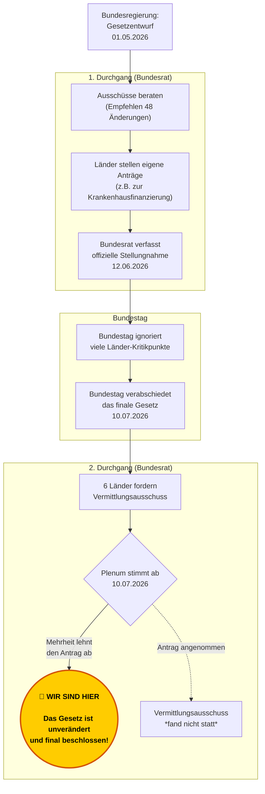

# Der Weg des Gesetzes (Chronologie)

Das GKV-Spargesetz hat einen komplexen parlamentarischen Weg mit vielen Schleifen und Einwänden durchlaufen, bevor es endgültig verabschiedet wurde. 

Das folgende Diagramm zeigt den Ablauf des Gesetzgebungsverfahrens – vom ersten Entwurf bis zum heutigen, finalen Stand.

---

> ℹ️ **Möchten Sie die genauen Originaldokumente zu den jeweiligen Schritten einsehen?**  
> Alle PDFs (wie die Ausschussempfehlungen, die Anträge der Länder und den finalen Gesetzesbeschluss) finden Sie chronologisch geordnet unter **[Original-Dokumente](../Eingangsdokumente/README.md)**.
